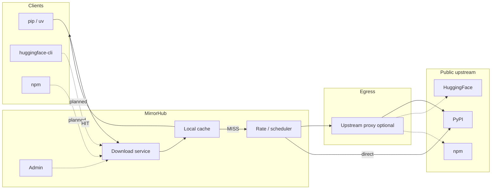

# MirrorHub

**Language:** [中文](README.zh-CN.md) | English

> Intranet download & cache hub — **fetch each artifact from the public internet once**, then share it across every laptop and CI job.
>
> **Warm the cache while online, keep installing when offline** — built for capped egress and air-gapped windows.
>
> Designed for constrained egress: **smart routing · parallel chunking · interactive-first scheduling · one-box ops**

**PyPI works today.** Hugging Face / npm / Docker are on the roadmap.


---

## Why teams reach for MirrorHub

Corporate networks usually fail installs the same way:

- Egress is capped; `torch`, CUDA wheels, and fat wheels crawl for tens of minutes on a single connection
- The same multi-GB blob is pulled again by the next developer, the next CI matrix cell, the next night rebuild
- Everyone configures their own proxy and retries — pain multiplies per machine, with **no shared on-disk cache**

MirrorHub is the shared choke point that **pulls once, caches locally, and serves the LAN at full speed**.  
Prefetch (or install once) while you have egress; **after that, clients can keep installing through the same local `index-url` with the upstream offline** — drills, isolated labs, shipboard / OT networks.  
Need international egress? Set one **upstream proxy (HTTP/SOCKS)** on the server — not on every laptop.

---

## Advantages & design

MirrorHub is not “another PyPI mirror.” It is an **ops-shaped download plane** built around how intranet teams actually install software.

### 1. Two ports, clear responsibilities

| Plane | Default | Job |
|-------|---------|-----|
| **Download service** | `:18081` | What `pip` / `uv` talk to — indexes, packages, cache hits |
| **Admin** | `:18082` | Dashboard, queue, prefetch, settings — keep ops off the hot path |

Clients never need the admin port. Operators never confuse “proxy for users” with “panel for admins.”

### 2. Smart path: right strategy per object

- **Indexes & small metadata** → lightweight proxy + rewrite (fast, cache-friendly)
- **Large artifacts** → **HTTP Range parallel chunks** (saturate the allowed egress, then stick locally)
- **Index links** rewrite to *this* download host automatically from the request **Host** — LAN machines just point at MirrorHub; no brittle hard-coded public URL in most setups

### 3. Interactive-first scheduling (design center)

Bandwidth and concurrency are scheduled like an ops product, not a dumb pipe:

| Class | Role | Behavior |
|-------|------|----------|
| **P0** Interactive | Someone is waiting on `pip install` | **No bandwidth shaping** — finish the human job first |
| **P1** Resume | Prefetch paused mid-flight | Soft-pause / resume without throwing away progress when possible |
| **P2** Prefetch | Background warm-up | Yields under load; time-window limits apply here |

Result: daytime installs stay snappy; nights and idle windows fill the cache.

### 4. Prefetch that respects the link

Paste requirements / `pyproject` dependency lines → resolve the dependency closure → warm the cache ahead of the rush.  
Prefetch is first-class in the UI (queue, progress, batch cancel) so you can see and control backfill instead of guessing.

### 5. Download first, use offline later

Typical flow: **prefetch (or install once) online → artifacts on disk → keep using the same `index-url` with no upstream**.

- **Wheels / sdists** serve as local HITs with no outbound calls  
- **Indexes / metadata** that expire while upstream is down fall back to the last cached copy (`X-Cache: STALE`) so installs don’t die on a dead link  
- Anything not cached still needs the network — warm the target platforms and closure via prefetch before you go offline (package-count cap is configurable)

### 6. One container, zero client sprawl

- Single image: Go binary + embedded admin UI + SQLite (or Postgres if you prefer)
- Data on a volume (`/data`) — **update the image, keep the cache**
- **Public setup guide** at `/` (no login; default entry): pick a local download address, copy `pip` / `uv` snippets

### 7. Built to grow beyond PyPI

Platforms are **modules** (enable, upstreams, download knobs). PyPI ships now; HF / npm / Docker plug into the same download + cache + rate plane later — one habit for the whole org.

```text
  Dev / CI                              Public upstream
      │                                       ▲
      ▼                                       │
  ┌─ MirrorHub ─────────────────┐            │
  │ Download ──► cache HIT?     │            │
  │               │ miss         │            │
  │               ▼              │            │
  │          chunked fetch ─opt─► 🌐 upstream proxy ─┘
  │ Admin: guide · queue · limits│
  └──────────────────────────────┘
```

---

## Feature map

| | Capability | Why it matters |
|--|------------|----------------|
| ⚡ | Parallel chunks | Large wheels stop wasting a single TCP stream |
| 💾 | Local cache + TTL / size caps | Second install is LAN-speed |
| 📴 | Download first, offline later | Warm the closure; install with upstream down |
| 🎯 | Strategy routing | Indexes stay light; payloads go wide |
| 📝 | Host-aware index rewrite | Clients use the address they already hit |
| 🌐 | Server-side upstream proxy | Configure egress **once** |
| 🎚️ | Windowed rate limits | Protect the shared pipe; don’t punish interactive installs |
| 🔥 | Prefetch + live queue UX | Warm cache with progress you can trust |
| 📊 | Admin UI | Capacity, hits, P0/P1, packages, settings in one place |
| 🧩 | Modular platforms | Same ops model as you add sources |

---

## vs [devpi](https://devpi.net/)

| | MirrorHub | devpi |
|--|:---------:|:-----:|
| Role | Unified **downloader / multi-source cache** for the LAN | PyPI mirror + **private indexes & publish** |
| Avoid repeat downloads | ✅ | ✅ |
| Chunking · interactive-first limits · prefetch · ops UI | ✅ | — |
| Upstream proxy (server egress) | ✅ | Depends on deploy |
| Private upload · index inheritance | — | ✅ |

```text
MirrorHub: client ──► download svc ──► cache ──► upstream (optional proxy)
devpi:     client ──► index tree ─┬─► private packages
                                 └─► root/pypi mirror
```

Use **MirrorHub** when the pain is egress and repeated pulls.  
Use **devpi** when you need a private package warehouse. Many teams run both.

---

## Architecture



---

## Quick start

### 1. Docker Compose (recommended)

```bash
cd deploy
docker compose up -d
```

| URL | Role |
|-----|------|
| http://localhost:18081 | Download service (`pip -i` / `uv`) |
| http://localhost:18082 | Admin UI (default `admin` / `admin`; opens on the guide) |
| http://localhost:18082/login | Login |

Image: `ghcr.io/nihaoyanzu/mirrorhub:latest`. Local build: `docker compose up -d --build`.

### 2. First-time admin config

Defaults are usually enough:

```text
Login: admin / admin

System settings
  · Local addresses → readonly hints for clients (IP:download-port)
  · Public Host → leave empty to rewrite from request Host
  · Upstream proxy → empty (direct) or socks5://127.0.0.1:1080 if required

PyPI module
  · Enabled: yes
  · Index / file upstream → https://mirrors.aliyun.com/pypi (or your mirror)
```

> **Upstream proxy** = MirrorHub’s own path to the public internet.  
> It is **not** each laptop’s `HTTP_PROXY`, and **not** the download service URL.

### 3. Client: PyPI

```bash
# one-off
pip install torch -i http://localhost:18081/simple/ --trusted-host localhost

# persistent
pip config set global.index-url http://localhost:18081/simple/
pip config set global.trusted-host localhost

# uv
uv pip install torch -i http://localhost:18081/simple/
```

```text
pip ──► /simple/     index (links rewritten to the download service)
     ──► /packages/  wheel / sdist
            │
       HIT ✅ local    MISS ❌ backfill (optional upstream proxy) → cache
```

Prefetch, queues (with progress), and package search live in the admin UI.  
Rate limits: **System → pull rate** (aimed at prefetch; interactive stays preferred).

### 4. Other clients (planned)

| Client | Status | Expected config |
|--------|:------:|-----------------|
| pip / uv | ✅ | `-i http://localhost:18081/simple/` |
| npm | ✅ | `npm config set registry http://localhost:18081/` |
| Docker | ✅ | `registry-mirrors` → `http://localhost:18081` |
| Go modules | ✅ | `export GOPROXY=http://localhost:18081,direct` |
| HuggingFace | ☐ | `export HF_ENDPOINT=http://localhost:18081` |
| R / CRAN | ☐ | `options(repos = c(CRAN = "http://localhost:18081/"))` |
