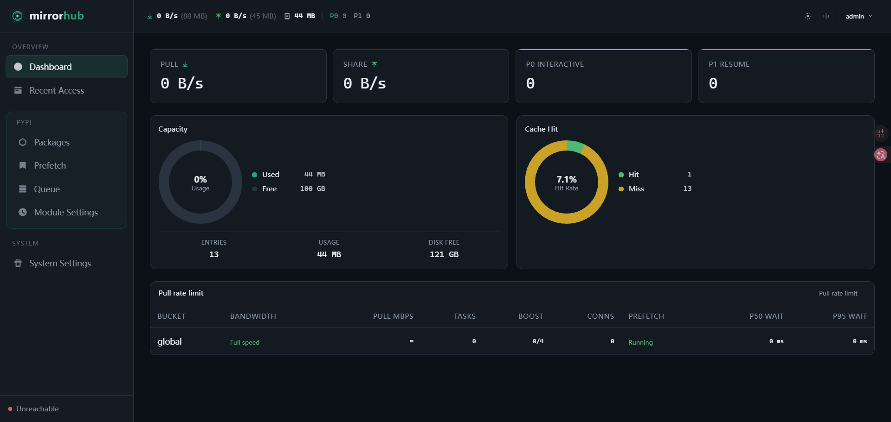
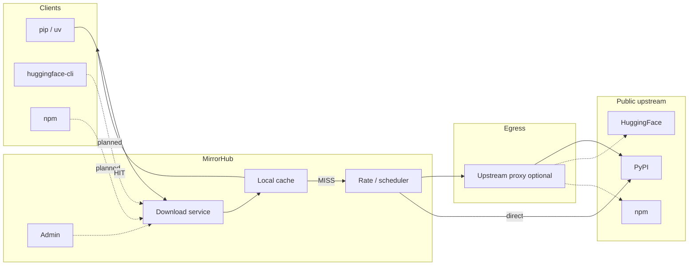

# MirrorHub

**Language:** [中文](README.zh-CN.md) | English

> Intranet download & cache hub — **fetch each artifact from the public internet once**
>
> Smart routing · Parallel chunking · Local cache · Rate limits · Multi-source ready

**PyPI works today.** Hugging Face / npm / Docker are planned.



---

## Why

Typical pain on a corporate network:

- Egress is rate-limited; `torch`, CUDA wheels, and model weights are multi-GB — a single-threaded install can take half an hour
- Fat dependency trees: one `pip install` pulls dozens of packages; CI matrices multiply that across pipelines — the same large files hit the throttle again and again
- Everyone installs at once, saturates the link, and still has no shared on-disk cache — the next machine crawls the same bytes
- Each laptop configures its own proxy and retries; without a shared cache, the pain repeats per machine

MirrorHub is a **unified download entry + chunked backfill + local cache**.  
If you need international egress, set an **upstream proxy (HTTP/SOCKS)** in system settings — used by the server when fetching upstream, not on every developer machine.

```text
  Dev / CI                              Public upstream
      │                                       ▲
      ▼                                       │
  ┌─ MirrorHub ─────────────────┐            │
  │ Download svc ──► cache HIT? │            │
  │                 │ no         │            │
  │                 ▼            │            │
  │            chunked fetch ─opt─► 🌐 upstream proxy ─┘
  │ Admin: config / queue / limits│
  └──────────────────────────────┘
```

---

## Features

| | Feature | Notes |
|--|---------|-------|
| ⚡ | Parallel chunks | HTTP Range, multi-connection for large files |
| 💾 | Local cache | Serve hits locally; size & TTL configurable |
| 🎯 | Routing | Proxy indexes / small files; parallel for large packages |
| 📝 | Rewriting | Rewrite simple index links to this download service |
| 🌐 | Upstream proxy | Global outbound HTTP/SOCKS for backfill |
| 🎚️ | Rate scheduling | Time-window bandwidth; interactive first, prefetch yields |
| 🔥 | Prefetch | Warm cache from dependency specs |
| 📊 | Admin UI | Dashboard, access log, queue, package search, settings |
| 🧩 | Multi-platform | PyPI now; HF / npm / Docker as modules later |

---

## vs [devpi](https://devpi.net/)

| | MirrorHub | devpi |
|--|:---------:|:-----:|
| Role | Unified downloader / multi-source cache | PyPI mirror + private indexes & publish |
| Avoid repeat downloads | ✅ | ✅ |
| Chunking · rate limit · prefetch · ops UI | ✅ | — |
| Upstream proxy (server egress) | ✅ | Depends on deploy |
| Private upload · index inheritance | — | ✅ |

```text
MirrorHub: client ──► download svc ──► cache ──► upstream (via upstream proxy)
devpi:     client ──► index tree ─┬─► private packages
                                 └─► root/pypi mirror
```

---

## Architecture



---

## Quick start

### 1. Docker Compose (recommended, single container)

```bash
cd deploy
docker compose up -d
```

| URL | Role |
|-----|------|
| http://localhost:18081 | Download service (`pip -i`) |
| http://localhost:18082 | Admin UI (default `admin` / `admin`) |

| Role | Port | Use |
|------|------|-----|
| 📥 Download | `:18081` | Point clients here |
| 🛠️ Admin | `:18082` | Web login & config |

Image: `ghcr.io/nihaoyanzu/mirrorhub:latest` (after Actions publishes; or `docker compose up -d --build` locally).

### 2. First-time admin config

Defaults usually work as-is:

```text
Login: admin / admin

System settings
  · Public Base URL (PublicHost) → 127.0.0.1:18081 (index link rewrite)
  · Upstream proxy → empty (direct, no proxy)

PyPI module
  · Enabled: yes
  · Index / file upstream → https://mirrors.aliyun.com/pypi
```

If the host cannot reach upstream directly, set upstream proxy e.g. `socks5://127.0.0.1:1080`.  
For LAN clients, set PublicHost to `<host-ip>:18081`.

> **Upstream proxy** = MirrorHub’s own egress to the public internet.  
> It is **not** your laptop’s `HTTP_PROXY`, and **not** another name for the download service.

### 3. Client: PyPI

```bash
# one-off
pip install torch -i http://localhost:18081/simple/ --trusted-host localhost

# persistent
pip config set global.index-url http://localhost:18081/simple/
pip config set global.trusted-host localhost

# uv
uv pip install torch -i http://localhost:18081/simple/
```

```text
pip ──► /simple/     index (links rewritten to download service)
     ──► /packages/  wheel / sdist
            │
       HIT ✅ local    MISS ❌ backfill (via upstream proxy) → cache
```

Prefetch, queues, and cached packages live in the admin UI. Rate limits: **System → pull rate** (mainly prefetch).

### 4. Other clients (planned)

| Client | Status | Expected config |
|--------|:------:|-----------------|
| 🐍 pip / uv | ✅ | `-i http://localhost:18081/simple/` |
| 🤗 HuggingFace | ☐ | `export HF_ENDPOINT=http://localhost:18081` |
| 📦 npm | ☐ | `npm config set registry http://localhost:18081/` |
| 🐳 Docker | ☐ | `registry-mirrors` → `http://localhost:18081` |
| 📊 R / CRAN | ☐ | `options(repos = c(CRAN = "http://localhost:18081/"))` |

