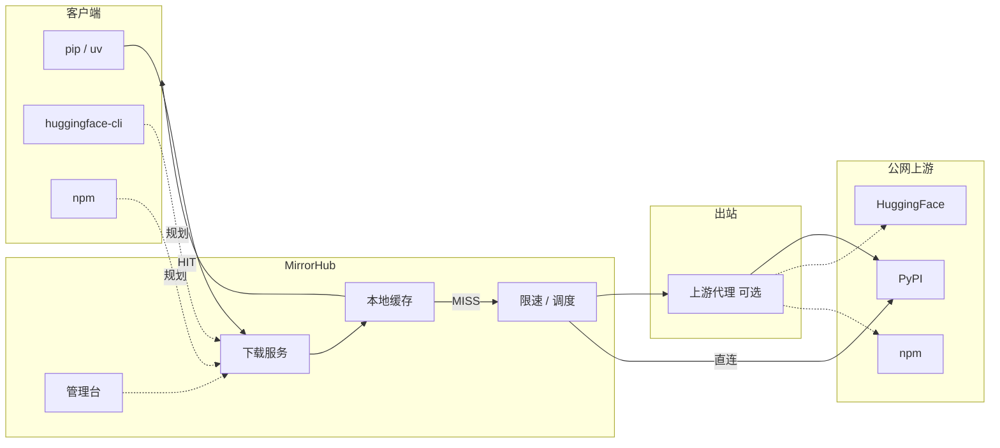

# MirrorHub

**语言 / Language:** 中文 | [English](README.md)

> 内网统一下载与缓存节点 —— **同一份制品只从公网拉一次**
>
> 智能路由 · 并行分片 · 本地缓存 · 限速调度 · 可扩展多源

当前 **PyPI 已可用**；HuggingFace / npm / Docker 等待完成

---

## 背景

内网里常见情况：

- 出口带宽被限速，`torch`、CUDA wheel、模型权重动辄几 GB，单线程慢慢爬，装一个环境能卡半小时
- 依赖树又深又胖：一次 `pip install` 拉几十个包，CI 矩阵再乘上十几份流水线——同样的大文件在公网反复过限速闸门
- 白天大家一起装环境，出口被打满、限速更狠；同样的大包却没有落盘共享，下一台机器还得再爬一遍
- 每个开发机各自配代理、各自扛超时重试，没有统一缓存，痛在每台机器上重复一遍

MirrorHub 做的是：**统一下载入口 + 分片回源 + 本地缓存**。  
需要访问国际网时，在系统设置里配 **上游代理（HTTP/SOCKS）**，由服务端回源时使用——不是让每个开发机各自配一遍。

```text
  开发机 / CI                         公网上游
      │                                    ▲
      ▼                                    │
  ┌─ MirrorHub ─────────────────┐         │
  │ 下载服务 ──► 缓存 HIT?      │         │
  │              │ 否            │         │
  │              ▼               │         │
  │         分片回源 ──可选──► 🌐 上游代理 ─┘
  │ 管理台：配置 / 队列 / 限速   │
  └─────────────────────────────┘
```

---

## 功能

| | 能力 | 说明 |
|--|------|------|
| ⚡ | 并行分片 | HTTP Range，大文件多连接拉取 |
| 💾 | 本地缓存 | 命中直出；容量与 TTL 可配 |
| 🎯 | 路由策略 | 索引/小文件代理；大文件并行 |
| 📝 | 内容改写 | simple 索引链接改写到本机下载服务 |
| 🌐 | 上游代理 | 全局出站 HTTP/SOCKS，方便回源走国际网 |
| 🎚️ | 限速调度 | 时段带宽；交互优先，预取可让路 |
| 🔥 | 预取 | 按依赖规格预热缓存 |
| 📊 | 管理台 | 仪表盘、访问、队列、包检索、系统/模块设置 |
| 🧩 | 多平台 | 现 PyPI；HF / npm / Docker 等按模块扩展 |

---

## 与 [devpi](https://devpi.net/)

| | MirrorHub | devpi |
|--|:---------:|:-----:|
| 定位 | 统一下载器 / 多源缓存加速 | PyPI 镜像 + 私有索引与发布 |
| 避免重复下载 | ✅ | ✅ |
| 分片 · 限速 · 预取 · 运维面板 | ✅ | — |
| 上游代理（服务端出站） | ✅ | 视部署 |
| 私有包上传 · 多索引继承 | — | ✅ |

```text
MirrorHub：客户端 ──► 下载服务 ──► 缓存 ──► 上游（可经上游代理）
devpi：   客户端 ──► 索引树 ─┬─► 私有包
                            └─► root/pypi 镜像
```

---

## 架构



---

## 快速开始

### 1. Docker Compose（推荐，单容器）

```bash
cd deploy
docker compose up -d
```

| 端口 | 用途 |
|------|------|
| http://localhost:18081 | 下载服务（`pip -i`） |
| http://localhost:18082 | 管理台（默认 `admin` / `admin`） |

| 角色 | 示例端口 | 用途 |
|------|----------|------|
| 📥 下载服务 | `:18081` | `pip` 等客户端指向这里 |
| 🛠️ 管理台 | `:18082` | Web 登录与配置 |

镜像：`ghcr.io/nihaoyanzu/mirrorhub:latest`（Actions 推送后可直接 pull；本地也可用 `docker compose up -d --build`）。

### 2. 首次配置（管理台）

默认已可用，一般不用改：

```text
登录：admin / admin

系统设置
  · 对外 Base URL（PublicHost）→ 127.0.0.1:18081（索引链接改写到下载服务）
  · 上游代理 → 空（直连，无代理）

PyPI 模块
  · 启用：是
  · 索引 / 文件上游 → https://mirrors.aliyun.com/pypi
```

若机器直连不了上游、必须走公司出口，再在「上游代理」填如 `socks5://127.0.0.1:1080`。
局域网其它机器访问时，把 PublicHost 改成 `<宿主机IP>:18081`。

> **上游代理** = MirrorHub 自己访问公网时用的出口。  
> **不是** 给本机 `pip` 配的 `HTTP_PROXY`，也不是「下载服务」的别名。

### 3. 客户端：PyPI

```bash
# 临时
pip install torch -i http://localhost:18081/simple/ --trusted-host localhost

# 持久
pip config set global.index-url http://localhost:18081/simple/
pip config set global.trusted-host localhost

# uv
uv pip install torch -i http://localhost:18081/simple/
```

```text
pip ──► /simple/     索引（链接已改写到下载服务）
     ──► /packages/  wheel / sdist
            │
       HIT ✅ 本地    MISS ❌ 回源（可经上游代理）→ 写入缓存
```

管理台可预取依赖、查看队列与已缓存包；限速见 **系统设置 → 拉取限速**（主要约束预取）。

### 4. 其他客户端（规划中）

| 客户端 | 状态 | 预期配置 |
|--------|:----:|----------|
| 🐍 pip / uv | ✅ | `-i http://localhost:18081/simple/` |
| 🤗 HuggingFace | ☐ | `export HF_ENDPOINT=http://localhost:18081` |
| 📦 npm | ☐ | `npm config set registry http://localhost:18081/` |
| 🐳 Docker | ☐ | `registry-mirrors` → `http://localhost:18081` |
| 📊 R / CRAN | ☐ | `options(repos = c(CRAN = "http://localhost:18081/"))` |

---

## 授权

本项目采用 [GNU General Public License v3.0](LICENSE)。
