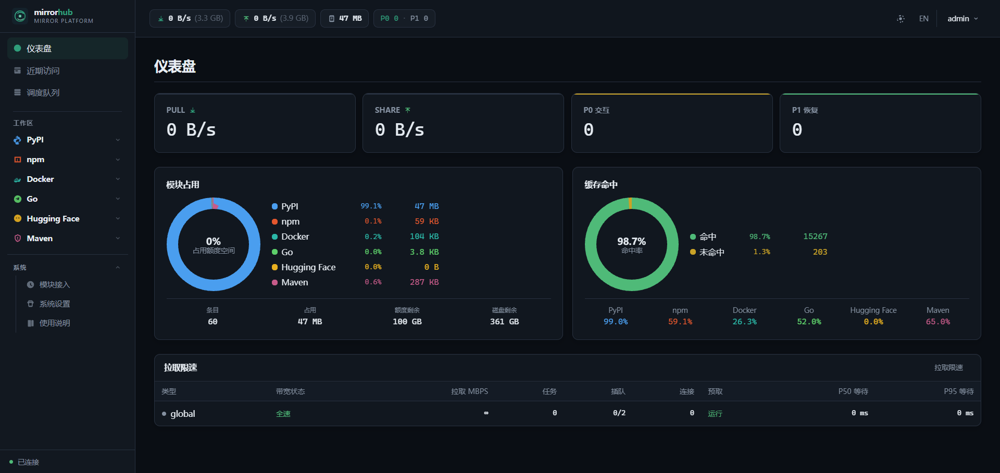
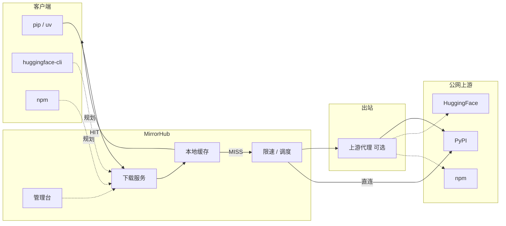

# MirrorHub

**语言 / Language:** 中文 | [English](README.md)

> 内网统一下载与缓存节点 —— **同一份制品只从公网拉一次**，再被全员与 CI 共享。
>
> 面向受限出口而设计：**智能路由 · 并行分片 · 交互优先调度 · 单机可运维**

当前 **PyPI 已可用**；Hugging Face / npm / Docker 在规划中。



---

## 为什么用 MirrorHub

内网装环境，痛点几乎总是同一套：

- 出口被限速；`torch`、CUDA wheel、大包在单连接上能爬十几分钟
- 下一台开发机、下一格 CI 矩阵、当晚再构建——**同一份 GB 级文件又过一遍闸门**
- 每人各自配代理、各自重试——痛苦按机器数倍增，却**没有落盘共享缓存**

MirrorHub 做共享卡口：**拉一次、本地缓存、局域网全速分发**。  
需要国际网？在服务端配一次 **上游代理（HTTP/SOCKS）**——不是给每台笔记本各配一遍。

---

## 优势与设计

MirrorHub 不是「又一个 PyPI 镜像」，而是按内网真实装包方式打磨的 **运维型下载面**。

### 1. 双端口，职责拆开

| 平面 | 默认 | 职责 |
|------|------|------|
| **下载服务** | `:18081` | `pip` / `uv` 对接 —— 索引、制品、缓存命中 |
| **管理台** | `:18082` | 仪表盘、队列、预取、设置 —— 运维不占热路径 |

客户端永远不必碰管理端口；运维也不会把「给用户的下载入口」和「给管理员的面板」搅在一起。

### 2. 智能路径：按对象选策略

- **索引与小元数据** → 轻量代理 + 改写（快、好缓存）
- **大制品** → **HTTP Range 并行分片**（尽量吃满允许的出口，再钉在本地）
- **索引链接** 按请求 **Host** 自动改写到本机下载服务 —— 局域网机器指向 MirrorHub 即可；多数场景不必再手写脆弱的对外 URL

### 3. 交互优先调度（设计核心）

带宽与并发按「运维产品」调度，而不是傻管道：

| 等级 | 角色 | 行为 |
|------|------|------|
| **P0** 交互 | 有人在等 `pip install` | **不做带宽整形** —— 先完成人等的任务 |
| **P1** 恢复 | 预取被软暂停 | 尽量保留进度，再恢复，而不是整包作废重来 |
| **P2** 预取 | 后台预热 | 负载高时让路；时段限速主要落在这里 |

白天装包要快；夜间与空闲窗口把缓存填满。

### 4. 预取尊重出口

粘贴 requirements / `pyproject` 依赖行 → 解析 → 在高峰前预热。  
预取在 UI 里一等公民（队列、进度、批量取消）——回源看得见、控得住，而不是盲拉。

### 5. 单容器，客户端零扩散

- 一个镜像：Go 二进制 + 内嵌管理台 + SQLite（也可接 Postgres）
- 数据落 volume（`/data`）—— **换镜像保留缓存**
- **公开说明页** `/`（免登录）：选本机下载地址，一键复制 `pip` / `uv` 命令

### 6. 为多源扩展而留位

平台按 **模块** 启用（上游、下载参数）。PyPI 已交付；HF / npm / Docker 将来接入同一套下载 + 缓存 + 限速平面 —— 组织内只学一套习惯。

```text
  开发机 / CI                         公网上游
      │                                    ▲
      ▼                                    │
  ┌─ MirrorHub ─────────────────┐         │
  │ 下载服务 ──► 缓存 HIT?      │         │
  │              │ 否            │         │
  │              ▼               │         │
  │         分片回源 ──可选──► 🌐 上游代理 ─┘
  │ 管理台：说明 · 队列 · 限速   │
  └─────────────────────────────┘
```

---

## 能力一览

| | 能力 | 价值 |
|--|------|------|
| ⚡ | 并行分片 | 大 wheel 不再浪费在单条 TCP 上 |
| 💾 | 本地缓存 + 容量 / TTL | 第二次安装是局域网速度 |
| 🎯 | 策略路由 | 索引保持轻；载荷走宽 |
| 📝 | 按 Host 改写索引 | 客户端用已经访问到的地址 |
| 🌐 | 服务端上游代理 | 出口配置 **一次** |
| 🎚️ | 时段限速 | 护住共享管道；不惩罚交互安装 |
| 🔥 | 预取 + 可信队列 UX | 预热缓存，进度可核对 |
| 📊 | 管理台 | 容量、命中、P0/P1、包检索、设置一处搞定 |
| 🧩 | 模块化平台 | 加源时运维模型不变 |

---

## 与 [devpi](https://devpi.net/)

| | MirrorHub | devpi |
|--|:---------:|:-----:|
| 定位 | 面向局域网的统一 **下载器 / 多源缓存** | PyPI 镜像 + **私有索引与发布** |
| 避免重复下载 | ✅ | ✅ |
| 分片 · 交互优先限速 · 预取 · 运维面板 | ✅ | — |
| 上游代理（服务端出站） | ✅ | 视部署 |
| 私有包上传 · 多索引继承 | — | ✅ |

```text
MirrorHub：客户端 ──► 下载服务 ──► 缓存 ──► 上游（可经上游代理）
devpi：   客户端 ──► 索引树 ─┬─► 私有包
                            └─► root/pypi 镜像
```

出口与重复拉取是痛点 → 选 **MirrorHub**。  
需要私有包仓库 → 选 **devpi**。很多团队两者并存。

---

## 架构



---

## 快速开始

### 1. Docker Compose（推荐）

```bash
cd deploy
docker compose up -d
```

| URL | 用途 |
|-----|------|
| http://localhost:18081 | 下载服务（`pip -i` / `uv`） |
| http://localhost:18082 | 管理台（默认 `admin` / `admin`） |
| http://localhost:18082/ | **公开说明页**（免登录）— 选地址、复制 `pip` / `uv` |

镜像：`ghcr.io/nihaoyanzu/mirrorhub:latest`（或 `:1.1`）。本地构建：`docker compose up -d --build`。

### 2. 首次配置（管理台）

默认通常已可用：

```text
登录：admin / admin

系统设置
  · 本机地址 → 只读提示（IP:下载端口），给客户端选用
  · Public Host → 留空，按请求 Host 自动改写索引
  · 上游代理 → 空（直连），或 socks5://127.0.0.1:1080（需走出口时）

PyPI 模块
  · 启用：是
  · 索引 / 文件上游 → https://mirrors.aliyun.com/pypi（或你的镜像）
```

> **上游代理** = MirrorHub 自己访问公网的出口。  
> **不是** 本机 `pip` 的 `HTTP_PROXY`，也不是「下载服务」的别名。

### 3. 客户端：PyPI

```bash
# 临时
pip install torch -i http://localhost:18081/simple/ --trusted-host localhost

# 持久
pip config set global.index-url http://localhost:18081/simple/
pip config set global.trusted-host localhost

# uv
uv pip install torch -i http://localhost:18081/simple/
```

```text
pip ──► /simple/     索引（链接已改写到下载服务）
     ──► /packages/  wheel / sdist
            │
       HIT ✅ 本地    MISS ❌ 回源（可经上游代理）→ 写入缓存
```

预取、带进度的队列、包检索都在管理台。  
限速见 **系统设置 → 拉取限速**（主要约束预取；交互优先）。

### 4. 其他客户端（规划中）

| 客户端 | 状态 | 预期配置 |
|--------|:----:|----------|
| pip / uv | ✅ | `-i http://localhost:18081/simple/` |
| HuggingFace | ☐ | `export HF_ENDPOINT=http://localhost:18081` |
| npm | ☐ | `npm config set registry http://localhost:18081/` |
| Docker | ☐ | `registry-mirrors` → `http://localhost:18081` |
| R / CRAN | ☐ | `options(repos = c(CRAN = "http://localhost:18081/"))` |
